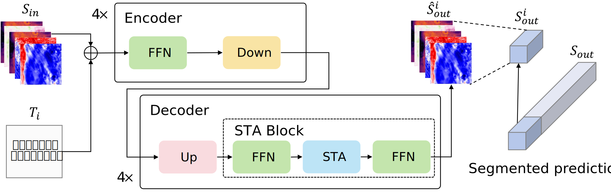

## SegSTA: A Segmented Prediction Strategy for Fine-Grained Spatiotemporal Prediction

> 
This repository contains the official PyTorch implementation of the following paper:
> **SegSTA: A Segmented Prediction Strategy for Fine-Grained Spatiotemporal Prediction** 
> Paper:  
> 
> **Abstract** *Accurate modeling of spatiotemporal dynamics is essential for reliable prediction. Existing methods predominantly learn patterns from tasks with limited complexity. This limitation becomes evident in complex tasks such as meteorological forecasting, where they possess more variables and longer prediction sequences, exhibiting higher prediction complexity and training costs. To address these challenges, we propose SegSTA (Segmented SpatioTemporal Attention network), a novel framework characterized by: the STA (SpatioTemporal Attention) module for adaptively capturing spatiotemporal dynamic dependencies; A segmented prediction strategy that divides long prediction sequences into multiple temporal segments for individual prediction, capable of reducing prediction complexity and training costs; A time-segment-weighted loss that adjusts error focus on different segments to reduce cumulative errors between segments. We evaluate our method on multiple datasets, with results showing an average improvement of approximately 10\% compared to the best methods. As a universal prediction strategy, the segmented prediction strategy generally enhances existing popular models, validating its potential for real-world applications.*

## Requirements
- python 3
- pytorch
- einops
- numpy
- netcdf4

## License
This project is released under the Apache 2.0 license. See LICENSE for more information.
